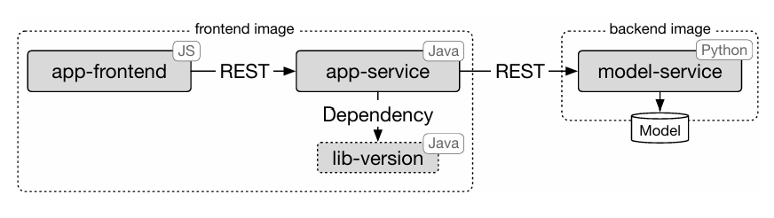

# SMS Checker Operation Repository Team 9

Welcome to the **SMS Checker** project! This repository serves as the central hub for the infrastructure, deployment, and operation of our machine-learning-powered SMS spam detection system.

## Repository Structure

The project is split across four repositories:

| Repository                                                         | Description                                                                                           |
|:-------------------------------------------------------------------|:------------------------------------------------------------------------------------------------------|
| **[operation](https://github.com/doda25-team9/operation)**         | **You are here.** Contains Infrastructure-as-Code (Ansible, Vagrant), Helm charts, and documentation. |
| **[app](https://github.com/doda25-team9/app)**                     | The Java Spring Boot frontend service.                                                                |
| **[model-service](https://github.com/doda25-team9/model-service)** | The Python Flask API serving the Machine Learning model.                                              |
| **[lib-version](https://github.com/doda25-team9/lib-version)**     | A shared Maven library for version management.                                                        |

Here is a reference architecture diagram illustrating the system components and their interactions:


> **_NOTE:_**  As the operation repository contains lots of information and features we decided to split README into multiple files.
> The file you are currently reading - "main" README - contains the most important information to get you started. 
> For detailed information on each of the assignments (configuration, specifics of the implementation, etc.) please refer to the respective files in the `docs/assignments` folder.

---
## Prerequisites

Before starting, ensure you have the following installed on your host machine:

| Tool               | Purpose                                    |
|:-------------------|:-------------------------------------------|
| **VirtualBox**     | Hypervisor for VMs (Required for Vagrant). |
| **Vagrant**        | VM management automation.                  |
| **Ansible**        | Configuration management.                  |
| **Helm**           | Kubernetes package manager.                |
| **kubectl**        | Kubernetes command-line tool.              |
| **Minikube**       | For local Kubernetes testing.              |
| **istioctl**       | CLI for managing Istio Service Mesh.       |
| **Docker**         | For local Docker Compose testing.          |
| **Docker Compose** | For local multi-container orchestration.   |

Moreover, please clone this repository and all related repositories to have the complete project setup. It should look like this:
```
your-folder/
    app/
    model-service/
    lib-version/
    operation/
```

---
## Local Development Setup Using Docker Compose
### Prerequisites
You need to be logged into GitHub Container Registry to pull the images. If you haven't done this yet, follow these steps:
1. Generate a Personal Access Token (PAT) on GitHub with the `read:packages` scope.
2. Log in to GitHub Container Registry using Docker:
```
docker login ghcr.io -u YOUR_GITHUB_USERNAME
```
You will be prompted to enter your PAT as the password.

### Starting the Application
Please follow these steps to start the application:

```
cd operation
docker compose pull
docker compose up
```

This starts:

- `app` (exposed externally)
- `model-service` (internal only, so not exposed to host)

You can access the web application in your browser [http://localhost:8080/sms](http://localhost:8080/sms).
Alternatively, if you have specified a different `APP_PORT` in your `.env`, replace `8080` with that port.

## Deployment Guide

Choose one of the following deployment paths depending on your environment.

### Option A: Minikube Cluster
Best for quick testing on your personal machine.

1.  **Start Minikube:**
    ```bash
    minikube start \
    --driver=docker \
    --memory=4096 \
    --cpus=3
    
    minikube addons enable ingress
    ```
    Note: You can adjust memory and CPU based on your system capabilities. This is the minimum recommended for smooth operation.
    Note: For this driver to work, ensure Docker Desktop is running on your host machine.

2.  **Install Istio:**
    ```bash
    istioctl install --set profile=demo -y
    kubectl label namespace default istio-injection=enabled
    ```
3. **Deploy secrets**
    The assignments ask for pre-deployed secrets. They are used in model-service, Grafana and Alertmanager. You have to create them before installing the chart.
    ```bash
    kubectl create secret generic smtp-credentials \
      --from-literal=SMTP_USER="user" \
      --from-literal=SMTP_PASS="password"
    kubectl create secret generic alertmanager-smtp-secret \
      --from-literal=SMTP_USER="doda.team9@gmail.com" \
      --from-literal=SMTP_PASS="gmmu jedd hfrl ftyh"
    kubectl create secret generic grafana-admin-secret \
      --from-literal=admin-user="user" \
      --from-literal=admin-password="password"
    ```
4.  **Deploy Application:**
    ```bash
    cd helm-chart
    helm dependency update
    cd ..
    helm install sms-checker ./helm-chart
    ```

### Option B: Production Cluster (Vagrant VMs)
Simulates a real-world bare-metal cluster with 3 VMs.

1.  **Provision Infrastructure:**
    Creates Controller + 2 Workers and installs K8s, MetalLB, Ingress, and Istio.
    ```bash
    # 1. Start VMs (approx. 3-5 mins)
    vagrant up

    # 2. Finalize setup (Installs MetalLB, Ingress, Dashboard, Istio)
    ansible-playbook -u vagrant -i 192.168.56.100, ./playbooks/finalization.yml --private-key .vagrant/machines/ctrl/virtualbox/private_key
    
    # 3. Configure Cluster Access
    export KUBECONFIG=$(pwd)/kubeconfig
    ```
2. **Deploy secrets**
    The assignments ask for pre-deployed secrets. They are used in model-service, Grafana and Alertmanager. You have to create them before installing the chart.
    ```bash
    kubectl create secret generic smtp-credentials \
      --from-literal=SMTP_USER="user" \
      --from-literal=SMTP_PASS="password"
    kubectl create secret generic alertmanager-smtp-secret \
      --from-literal=SMTP_USER="doda.team9@gmail.com" \
      --from-literal=SMTP_PASS="gmmu jedd hfrl ftyh"
    kubectl create secret generic grafana-admin-secret \
      --from-literal=admin-user="user" \
      --from-literal=admin-password="password"
    ```
3.  **Deploy Application:**
    ```bash
    helm install sms-checker ./helm-chart --dependency-update
    ```
    
> **_Important! For Option B: Production Cluster (Vagrant VMs)_**
> **_Resource-Optimized Sidecar Injection_**
> 
> _If you would like to know more about it, please check **a3-instructions.md**_
> 
> 1. Wait for stable state
> ```bash
> kubectl wait --for=condition=available deployment --all --timeout=300s
> ```
> 2. Scale down: Free up RAM to prevent Deadlock
> ```bash
> kubectl scale deployment app-deployment-v1 app-deployment-v2 model-deployment-v1 model-deployment-v2 model-deployment-v3 --replicas=0
> ```
> 3. Enable Istio Injection
> ```bash
> kubectl label namespace default istio-injection=enabled --overwrite
> ```
> 4. Scale up: Restart with Sidecars injected
> ```bash
> kubectl scale deployment app-deployment-v1 app-deployment-v2 model-deployment-v1 model-deployment-v2 model-deployment-v3 --replicas=1
> ```

---
## Dashboard & App Access Table

To access the application via the hostname `sms-checker.local`, we need to map the hostname to cluster's Ingress IP.

**For Vagrant Cluster:** Map the hostname to the Ingress Controller's fixed IP (`192.168.56.95`).
```bash
echo "192.168.56.95 sms-checker.local" | sudo tee -a /etc/hosts
echo "192.168.56.95 stable.sms-checker.local" | sudo tee -a /etc/hosts
echo "192.168.56.95 canary.sms-checker.local" | sudo tee -a /etc/hosts
```
Open [http://sms-checker.local/sms/](http://sms-checker.local/sms/) in your browser.

Alternatively, you can connect directly to the stable version [http://stable.sms-checker.local/sms/](http://stable.sms-checker.local/sms/), or the canary version [http://canary.sms-checker.local/sms/](http://canary.sms-checker.local/sms/).

**For Minikube:** Map the hostname to `127.0.0.1` and use port-forwarding.
```bash
echo "127.0.0.1 sms-checker.local" | sudo tee -a /etc/hosts
echo "127.0.0.1 stable.sms-checker.local" | sudo tee -a /etc/hosts
echo "127.0.0.1 canary.sms-checker.local" | sudo tee -a /etc/hosts
kubectl port-forward -n istio-system svc/istio-ingressgateway 8080:80
```
Open [http://sms-checker.local:8080/sms/](http://sms-checker.local:8080/sms/) in your browser.

Alternatively, you can connect directly to the stable version [http://stable.sms-checker.local:8080/sms/](http://stable.sms-checker.local:8080/sms/), or the canary version [http://canary.sms-checker.local:8080/sms/](http://canary.sms-checker.local:8080/sms/).

| Component                | URL                                                            | Login / Details                                                                                  |
|:-------------------------|:---------------------------------------------------------------|:-------------------------------------------------------------------------------------------------|
| **Web Application**      | [http://sms-checker.local/sms/](http://sms-checker.local/sms/) | Main user interface.                                                                             |
| **Kubernetes Dashboard** | [https://dashboard.local](https://dashboard.local)             | To access it you need to follow additional steps in [A3 Instructions](./docs/a3-instructions.md) |
| **Grafana**              | [http://localhost:3000](http://localhost:3000)                 | **User:** `admin` <br> **Pass:** `admin123` <br> *(Requires port-forward)*.                      |
| **Prometheus**           | [http://localhost:9090](http://localhost:9090)                 | *(Requires port-forward)*.                                                                       |
| **AlertManager**         | [http://localhost:9093](http://localhost:9093)                 | *(Requires port-forward)*.                                                                       |


## Troubleshooting
1. It is possible that on running `vagrant up`, you encounter:
   `Stderr: VBoxManage: error: VirtualBox can't operate in VMX root mode.` This happens because VirtualBox conflicts with KVM. Run the following to solve this error:
```bash
sudo modprobe -r kvm_intel
sudo modprobe -r kvm
```
2. On some Linux hosts, the Ansible task that runs the `kubeadm join` command on workers during `vagrant up` may fail due to timeout or network interface mismatch.
   Try opening you VirtualBox application and disabling DHCP server.

More on deploying your own cluster can be found in [Assignment 2 Documentation](./docs/assignments/a2-instructions.md) and [Assignment 3 Documentation](./docs/assignments/a3-instructions.md).

---
## Monitoring & Metrics

We collect the following custom metrics:

| Metric Name                  | Type          | Description                                                     |
|:-----------------------------|:--------------|:----------------------------------------------------------------|
| `sms_requests_total`         | **Counter**   | Total number of SMS prediction requests received.               |
| `predictions_result_total`   | **Counter**   | Total predictions labeled by result (`spam` vs `ham`).          |
| `in_flight_requests`         | **Gauge**     | How many requests are currently being processed.                |
| `request_duration`           | **Histogram** | Distribution of request processing time (seconds).              |
| `sms_length`                 | **Histogram** | Distribution of the character length of submitted SMS messages. |
| `last_request_duration_ms`   | **Gauge**     | Duration of the last processed request (milliseconds).          |
| `last_sms_length_characters` | **Gauge**     | Character length of the last submitted SMS message.             |

More on monitoring, dashboards, and alerting can be found in [Assignment 3 Documentation](./docs/assignments/a3-instructions.md).

---
## Local Development with Docker Compose
For quick local testing and development, you can run the application using Docker Compose.
As the instructions are quite detailed, please refer to the [Assignment 1 Documentation](./docs/assignments/a1-instructions.md) for step-by-step guidance.

---
## Documentation - Assignment 4 and Additional Resources
The `\docs` folder contains additional documentation:
- `continuous-experimentation.md`
- `deployment.md`
- `extension.md`
- `\assignments` - folder that contains detailed instructions on testing and implementation of each assignment.
