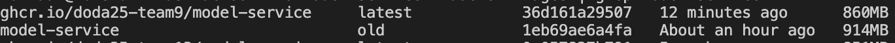

# Assignment 1: Local Docker Setup

This guide explains how to run the **SMS Checker** application locally using Docker Compose. This method is used for **Assignment 1** and for quick local development without the overhead of Kubernetes.

## Configuration

The Docker Compose setup is controlled by a `.env` file located in the root of the `operation` repository.

**Default Configuration:**
```
APP_PORT=8080
MODEL_PORT=8081
APP_IMAGE=ghcr.io/doda25-team9/app:latest
MODEL_IMAGE=ghcr.io/doda25-team9/model-service:latest
```

### Variable overview:
- `APP_PORT`:
  Port on the host machine where the web application will be exposed. After startup, the app is accessible at:
  `http://localhost:<APP_PORT>/sms`

- `MODEL_PORT`:
  Internal port used by the model-service container.
  The app communicates with the model-service over the Docker network using this port.

- `APP_IMAGE`:
  Docker image for web application.
  You can change this to a specific version tag (e.g.: `:0.1.0`) instead of `:latest` if needed.

- `MODEL_IMAGE`:
  Docker image for the model-service.
  You can change this to a specific version tag (e.g.: `:0.1.0`) instead of `:latest` if needed.

You can adjust ports or change image versions by editing this file before running `docker compose up`.

## Running the Full Application

### Prerequisites
You need to be logged into GitHub Container Registry to pull the images. If you haven't done this yet, follow these steps:
1. Generate a Personal Access Token (PAT) on GitHub with the `read:packages` scope.
2. Log in to GitHub Container Registry using Docker:
```
docker login ghcr.io -u YOUR_GITHUB_USERNAME
```
You will be prompted to enter your PAT as the password.

### Starting the Application
Please follow these steps to start the application:

```
cd operation
docker compose pull
docker compose up
```

This starts:

- `app` (exposed externally)
- `model-service` (internal only, so not exposed to host)

You can access the web application in your browser [http://localhost:8080/sms](http://localhost:8080/sms). 
Alternatively, if you have specified a different `APP_PORT` in your `.env`, replace `8080` with that port.

### Useful Docker Compose Commands

| Action                               | Command                      | Description                            |
| ------------------------------------ | ---------------------------- | -------------------------------------- |
| **Start everything**                 | `docker compose up`          | Starts all services (shows logs)       |
| **Start in background**              | `docker compose up -d`       | Runs services in detached mode         |
| **Stop all running services**        | `docker compose down`        | Stops and removes containers, networks |
| **Rebuild images**                   | `docker compose up --build`  | Rebuilds images before starting        |
| **View logs**                        | `docker compose logs`        | Shows combined logs from all services  |
| **View logs for a specific service** | `docker compose logs app`    | Shows logs only for the app            |
| **Restart one service**              | `docker compose restart app` | Restarts only the app service          |

## Grading Notes/Helpers
1. Feature 5 (F5) requires multi-stage image that illustrates the reduction in image size. Our example was implemented in model-service. A reduction of ~50MB was achieved, by applying 2 Stages (Builds, Runtime) in Dockerfile of model-service.



## Building Your Own Images
As suggested during the labs, we removed Maven installation from the Dockerfile in model-service, thus if you want to build your own images locally, please follow these steps:

### Prerequisites & Setup

**GitHub Token**: You need a Personal Access Token (PAT) with the read:packages scope to download the library dependencies.

1. **Configure Maven Authentication**
   Before building, you must configure Maven to authenticate with GitHub Packages.
   Generate a Personal Access Token (PAT) on GitHub:
   Go to Settings -> Developer Settings -> Personal Access Tokens (Classic).
   Generate a new token with the scope: read:packages.
   Create or edit your Maven settings file: **~/.m2/settings.xml.**
   Paste the following configuration (replace **YOUR_USERNAME and YOUR_TOKEN**):


```xml
<settings xmlns="http://maven.apache.org/SETTINGS/1.0.0"
  xmlns:xsi="http://www.w3.org/2001/XMLSchema-instance"
  xsi:schemaLocation="http://maven.apache.org/SETTINGS/1.0.0
                      http://maven.apache.org/xsd/settings-1.0.0.xsd">

  <servers>
    <server>
      <id>github</id>
      <username>**YOUR_GITHUB_USERNAME**</username>
      <password>**YOUR_GHP_TOKEN_HERE**</password>
    </server>
  </servers>
</settings>
```

2. Delete the files of output folder in model-service
3.  Build the Java Application

```
# Navigate to the app directory
cd app
1. Build the JAR (skipping tests for speed)
mvn clean package -DskipTests

2. Rename the output to 'app.jar' so Docker can find it
# (Adjust the source filename if your version is different)
mv target/frontend-*.jar target/app.jar

cd ..
```

4. **Build & Start Docker Containers**
   From the root directory (where docker-compose.yml is located):

```
1. Build the images
docker compose build --no-cache

2. Start the services
docker compose up
```
