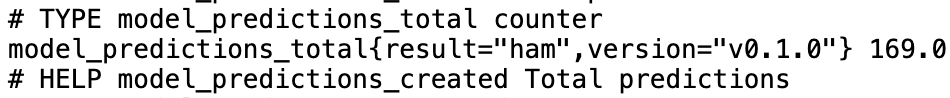
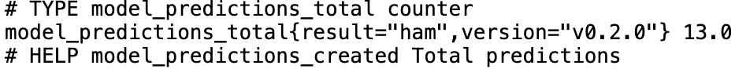

# Assignment 4: Istio Service Mesh
In this assignment we mostly focused on deploying our application and enabling us to conduct continuous experimentation.
You can read about the deployment process in the [Deployment File](../deployment.md).

If you already followed the setup instructions with Helm from [Assignment 3](./a3-instructions.md), you can directly proceed to the configuration options for Istio below.

## Configuration Options
### Adjust Traffic Split
```bash
# 95/5 split (more conservative)
helm upgrade sms-checker ./helm-chart \
  --set istio.trafficSplit.stable=95 \
  --set istio.trafficSplit.canary=5
```

### Change Hostname
```bash
helm upgrade sms-checker ./helm-chart \
  --set istio.host=custom.grader.local

# Update /etc/hosts if testing locally
echo "127.0.0.1 custom.grader.local" | sudo tee -a /etc/hosts
```
### Disable Canary
```bash
helm upgrade sms-checker ./helm-chart \
  --set versions.v2.enabled=false

# Verify only v1 pods exist
kubectl get pods | grep deployment
```
### Ingress Gateway

This chart deploys an Istio `Gateway` resource to route traffic into the mesh. It assumes an Istio Ingress Controller (Envoy proxy) is already running in the cluster (provisioned during the infrastructure phase).

**Configuration:**
The `Gateway` resource uses a label selector to find the Ingress Controller pod.
* **Default Selector:** `istio: ingressgateway` (Standard Istio default)
* **Customization:** If deploying to a cluster with a different Ingress Gateway name (e.g., `istio: custom-gateway`), you can configure this in `values.yaml`.

**How to override for different clusters:**
```bash
helm upgrade --install sms-checker ./helm-chart \
  --set istio.gateway.ingressGatewaySelector=custom-gateway
```
---

## Documentation

### Deployment Overview
You can read about the deployment process in the [Deployment File](../deployment.md).

### Extension Proposal
You can read our extension proposal in the [Extension Proposal File](../extension.md).

### Continuous Experimentation
You can read about our continuous experimentation setup in the [Continuous Experimentation File](../continuous-experimentation.md).

### Additional Use Case - Shadow Launch
We deploy a third model-service version (v3) that receives mirrored copies of all traffic from both the stable (v1) and canary (v2) versions, allowing us to evaluate the shadow version's performance using real user requests without exposing users to its responses.
Users only see results from v1/v2 while v3 silently processes the same requests and records metrics for comparison.

This section demonstrates how we verified that the **Shadow Launch** is active and that we can evaluate the new model version (v3) using **Custom Prometheus Metrics** without exposing it to the users.

#### 1. Reproduction Steps
To reproduce these results and inspect the metrics manually, follow these steps:

**Step 1: Generate Traffic**
Use the application UI or `curl` to send requests. The system is configured with a **90/10 Canary Split** (v1/v2) and a **100% Shadow Mirror** to v3.

Open [http://sms-checker.local:8080/sms](http://sms-checker.local:8080/sms) in your browser and do some requests.

**Step 2: Access Metrics Directly**
You can port-forward the pods to view the raw Prometheus metrics generated by our Python application.

```bash
# 1. Forward ports for all three versions (run in background)
kubectl port-forward deployment/model-deployment-v3 8082:8081 &
kubectl port-forward deployment/model-deployment-v2 8083:8081 &
kubectl port-forward deployment/model-deployment-v1 8084:8081 &

# 2. Fetch the metrics
curl localhost:8082/metrics # Shadow (v3)
curl localhost:8083/metrics # Canary (v2)
curl localhost:8084/metrics # Stable (v1)
```

---

#### 2. Evidence of Success
We analyzed the metrics after a manual test run. The data proves that **v3** is successfully processing traffic in the background.

#### **A. Traffic Mirroring (Shadow Launch)**
| Version | Role | Request Count (`model_predictions_total`) | Interpretation |
| :--- | :--- | :--- | :--- |
| **v1** | Stable | **169** | Handles ~90% of live traffic. |
| **v2** | Canary | **13** | Handles ~10% of live traffic. |
| **v3** | Shadow | **183** | **Mirrors 100% of traffic.** |





* **Analysis:** The total live traffic was `169 (v1) + 13 (v2) = 182`. The shadow instance (v3) processed `183` requests.
* **Conclusion:** The counts match (with a negligible offset of 1 due to async mirroring), proving that **v3 receives a copy of all traffic** without affecting the user response.

#### **B. Performance Evaluation (Latency Histogram)**
We use the custom metric `model_prediction_latency_seconds` to evaluate the performance of the unreleased model (v3) against the stable version (v1).

**v3 (Shadow) Latency Data:**
```text
model_prediction_latency_seconds_bucket{le="0.005",version="v0.1.0"} 181.0
model_prediction_latency_seconds_count{version="v0.1.0"} 183.0
```
* **Insight:** 181 out of 183 requests (~99%) on the new model were processed in under **5ms**.

**v1 (Stable) Latency Data:**
```text
model_prediction_latency_seconds_bucket{le="0.005",version="v0.1.0"} 0.0
model_prediction_latency_seconds_bucket{le="0.01",version="v0.1.0"} 100.0
```
* **Insight:** The stable model is slower; 0 requests were under 5ms, and most took up to **10ms**.

### 3. Final Conclusion

* **Evaluation:** The metrics prove that the Shadow Model (v3) is significantly faster (sub-5ms) than the Stable Model (v1).
* **Safety:** This data was collected from real production traffic mirrored to v3, but users only received responses from v1/v2.