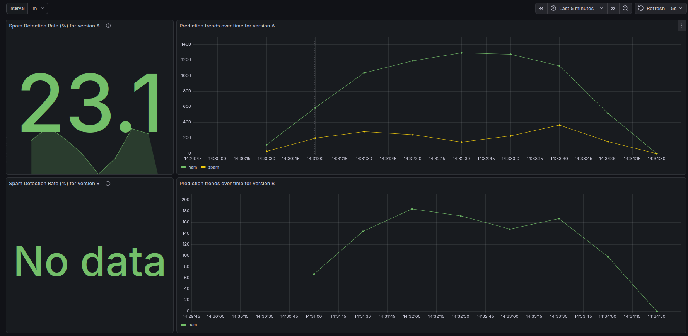
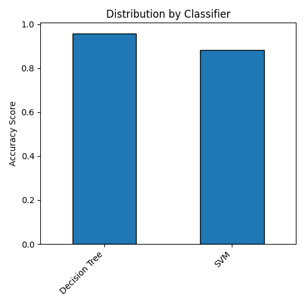
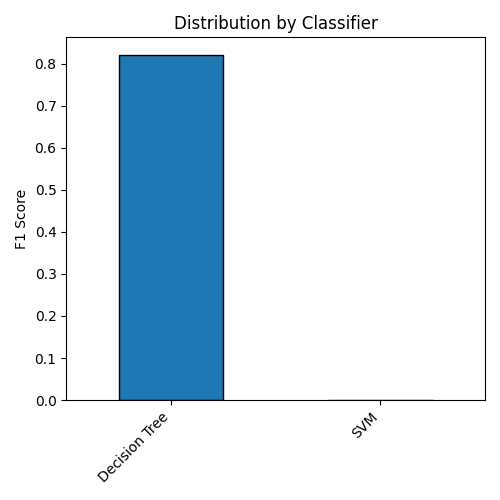

# Continuous Experimentation

## Introduction

We want to evaluate and compare a different model for spam prediction. According to the creators of the SMS Spam Collection Dataset, which was used to train our models, Support Vector Machines (SVCs) had the best baseline performance out of their evaluated models [[1]](#1). Further analysis that included more models still had the same conclusion [[2]](#2). Thus, we compared our initial model, a decision tree, against a Support Vector Classifier (SVC, a subtype of SVMs) which was trained by default in the `model-service` repository.
 
However, changing the model will change the predictions. For example, some messages classified as spam can now be classified as ham and the other way around. Additionally, we aim to mimic a real-life setting where we would not have information about the true labels of messages sent by users. Thus, we can not use an accuracy-based metrics, such as accuracy or F1-score. Since we want the transition between the different versions to be smooth for the users, we will evaluate the differences in positive prediction rates. The reason for this being that we are trying to avoid models with with vastly different spam prediction rates. For example, a user that initially observes 20% of messages flagged as spam, might be dissatisfied if suddenly our app flags 40% of messages. We want to ensure stability for our users, hence we propose the following hypothesis:

$H0$: Any observed difference in spam prediction rates between the two model versions is not statistically significant.

## Experiment Design

The decision tree is represented by model-service `v0.2.0`, model `v0.1.0` and app `v0.0.8-SNAPSHOT`, while the Support Vector Classifier (SVC) is represented by model-service `v0.3.0-SNAPSHOT`, model `v0.2.0` and app `v0.0.9-SNAPSHOT`.

### Data

We want to test how the models generalize, thus, reusing the training data will not give us great insights. Upon researching alternatives to the SMS Spam Collection which was used to train the models, we found the ExAIS SMS dataset. It contains 5,240 spam and ham messages across 20 users [[3]](#3). However, we also found a pre-processed version of which removes private data (e.g. bank account and phone numbers) and duplicate messages [[4]](#4). Despite this, it still had some faulty data which had to be removed. Thus, our dataset contained 4981 messages.

### Experiment

The full corpus was randomly split by the load balancer into two non-overlapping subsets: 90% was routed to the decision tree, and 10% was handled by the SVC. Since the subsets are independent and the outcomes are binary, we used a two-tailed two-proportion Z-test to see if the models had different spam detection rates. We chose a two-tailed test because we did not want to assume one model was better than the other. Instead, we wanted to know if there was a significant difference between them. To confirm it exists, we looked for a p-value below 0.05 (our chosen significance level is $\alpha=0.05$).

The test statistic was calculated with these formulas:
$$\hat{p} = \frac{x_1 + x_2}{n_1 + n_2}$$
$$Z = \frac{(\hat{p}_1 - \hat{p}_2)}{\sqrt{\hat{p}(1-\hat{p})(\frac{1}{n_1} + \frac{1}{n_2})}}$$

### Variable Definitions

| Symbol | Definition |
| :--- | :--- |
| $\hat{p}$ | **Pooled Proportion**: The combined success rate of both samples. |
| $x_{1,2}$ | **Successes**: Number of positive/correct outcomes for model v1 and model v2. |
| $n_{1,2}$ | **Sample Size**: Total observations for model v1  and model v2. |
| $\hat{p}_{1,2}$ | **Sample Proportions**: The observed rates for each model ($x / n$). |
| $Z$ | **Z-score**: The test statistic representing the difference in standard deviations. |

Since in a Standard Normal Distribution 95% of data is within 1.96 standard deviations from the mean, H0 will be rejected if $Z$ > 1.96 or if $Z$ < 1.96.

### Metrics

To measure the outcomes we created the `predictions_result_total` metric in `app-service` to track the counts of predictions by result (spam/ham). For each of the versions, the results can be found in `SMS Checker - Application Metrics` Grafana dashboard.

### Running the experiment

The experiment was run with this version configuration in `helm-chart/values.yaml`.

```yaml
versions:
  v1:
    enabled: true
    replicas: 3
    appImageTag: "0.0.8-SNAPSHOT"
    modelImageTag: "0.2.0"
    modelVersion: "v0.1.0"
  
  v2:
    enabled: true
    replicas: 1
    appImageTag: "0.0.9-SNAPSHOT"
    modelImageTag: "0.3.0-SNAPSHOT"
    modelVersion: "v0.2.0"
```

If you want to access the stable (v1) and canary (v2) versions on custom URLs, change the following values in `/helm-chart/values.yaml`:
```yaml
  stableHost: stable.sms-checker.local
  canaryHost: canary.sms-checker.local
```
Then make sure to add both of them to `/etc/hosts` like:
```bash
echo "127.0.0.1 <YOUR HOSTNAME HERE>" | sudo tee -a /etc/hosts
```

0. (Optional) Change the values if you want to evaluate different image versions
1. Start the cluster as described in the README.
1. Wait for all pods to start.
1. Port-forward ingress to connect to the cluster as described in the README. 
1. From the `experimentation` folder run `send_requests.py` which sends 4981 messages to the cluster.
1. Port-forward the Grafana dashboard, log in (instructions in the README) and open the `SMS Checker - A/B Experiment Results` dashboard. You should see the results there

To reach the versions separately, visit `http://stable.sms-checker.local:8080/sms/` and `http://canary.sms-checker.local:8080/sms/` or your custom URLs if you changed them.

## Result

The decision tree classified 835 spams and 3665 hams, whereas the SVC classified 0 spams and 490 hams.

Screenshot of Grafana results for the both models:

Version A uses the decision tree, version B uses the SVC. "No data" is caused by the model having no spams to calculate the metric with. 

The value of our test metric $Z$ is 10.0697. The value of p is < .00001. Therefore, the result is significant at p < .05. The dashboard supports this decision as it shows version B classifying everything as ham.   

## Analysis

To figure out why these results were so unbalanced, we analyzed model training. The SVC had 88% accuracy as opposed to 96% accuracy for the Decision tree. Initially, one might judge the training results based on accuracy, but in this context it can be largely misleading. In the SMS Spam Collection dataset, spam makes up 13.4% of the messages. Therefore, a model can achive high accuracy by always predicting ham.

To obtain a more complete overview, we can compare the F1 scores: the SVC had an abysmal score of 0 as opposed to 0.82 achieved by the decision tree. The model achieved such a low score by predicting everything as ham. This reaffirms our observation, where we found that even on a different dataset, the SVC performance is unsuitable for deployment.

<div style="display: flex; justify-content: space-around;">
  
  
</div>

## Conclusion

We reject the null hypothesis ($H0$) as the outputs of model v0.2.0 (SVC) significantly differ from model v0.1.0 (decision tree). Moreover, the SVC is currently unsuitable for deployment as during our experiment it did not flag anything as spam. This prevents us from conducting further experiments where we could check model outputs more thoroughly, such as evaluating using accuracy-based metrics and checking the prediction overlap on the ExAIS SMS dataset. Therefore, we will keep using the decision tree until the SVC is trained differently and achieves better performance.

## References

<a id="1">[1]</a> 
Almeida, T. A., Hidalgo, J. M. G., & Yamakami, A. (2011, September). Contributions to the study of SMS spam filtering: new collection and results. In Proceedings of the 11th ACM symposium on Document engineering (pp. 259-262).

<a id="2">[2]</a> 
Almeida, T., Hidalgo, J. M., & Silva, T. (2013). Towards sms spam filtering: Results under a new dataset. International Journal of Information Security Science, 2(1), 1-18.

<a id="3">[3]</a> 
Onashoga, A. S., Abayomi-Alli, O. O., Sodiya, A. S., & Ojo, D. A. (2015). An adaptive and collaborative server-side SMS spam filtering scheme using artificial immune system. Information Security Journal: A Global Perspective, 24(4-6), 133-145.

<a id="4">[4]</a> 
ysfbil. (2025). ExAIS SMS dataset [Data set]. Kaggle. https://www.kaggle.com/datasets/ysfbil/exais-sms-dataset