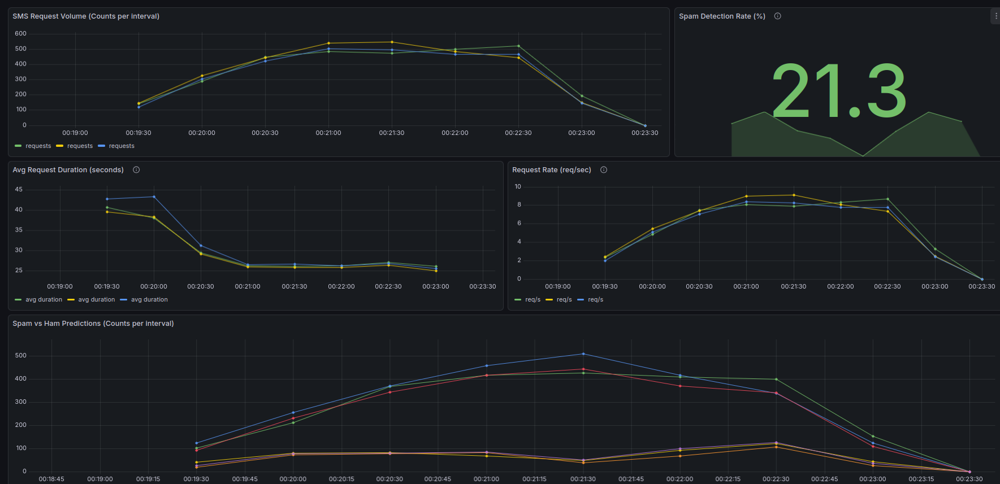
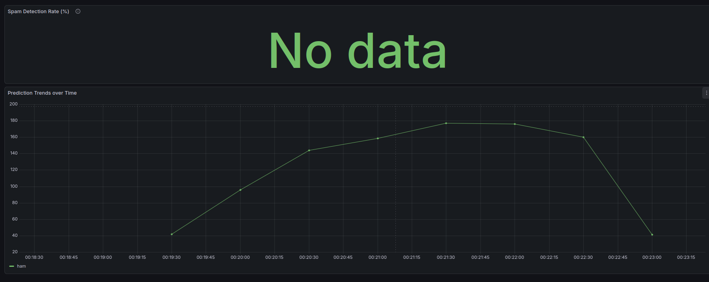

# Continuous Experimentation

## Introduction

We want to evaluate and compare a different model for spam prediction. According to the creators of the SMS Spam Collection Dataset, which was used to train our models, SVM performed the best baseline performance out of their evaluated models [[1]](#1). Further analysis that included more models still had the same conclusion [[2]](#2). Thus, we chose to compare our initial model, a decision tree, against a SVC that is available in the `model-service` repository.
 
However, changing the model will change the predictions. For example, some messages classified as spam can now be classified as ham and the other way around. Since we want the transition between the different versions to be smooth, we will evaluate the differences in predictions. Hence, our hypothesis is the following.

H0: The spam prediction rates of the new version will not differ significantly.

## Experiment Design

### Data

We want to test how the models generalize, thus, reusing the training data will not give us great insights. Upon researching alternatives to the SMS Spam Collection which was used to train the models, we found the ExAIS SMS dataset. It contains 5,240 spam and ham messages across 20 users [[3]](#3). However, we also found a pre-processed version of which removes private data (e.g. bank account and phone numbers) and duplicate messages [[4]](#4). Despite this, it still had some faulty data which had to be removed. Thus, our dataset contained 4981 messages.

### Experiment

The full corpus was randomly split by the load balancer into two subsets. 90% was routed to the decision tree, and 10% was routed to SVC. Since the samples were not overlapping, we used a Two-Tailed Two-Proportion Z-Test with p < 0.05.

The decision tree is represented by model-service `v0.2.0`, model `v0.1.0` and app `v0.0.8-SNAPSHOT`, whicle the SVC is represented by model-service `v0.3.0-SNAPSHOT`, model `v0.2.0` and app `v0.0.9-SNAPSHOT`

The test statistic was calculated with these formulas:
$$\hat{p} = \frac{x_1 + x_2}{n_1 + n_2}$$
$$Z = \frac{(\hat{p}_1 - \hat{p}_2)}{\sqrt{\hat{p}(1-\hat{p})(\frac{1}{n_1} + \frac{1}{n_2})}}$$

### Variable Definitions

| Symbol | Definition |
| :--- | :--- |
| $\hat{p}$ | **Pooled Proportion**: The combined success rate of both samples. |
| $x_{1,2}$ | **Successes**: Number of positive/correct outcomes for Model 1 and Model 2. |
| $n_{1,2}$ | **Sample Size**: Total observations for Model 1 (4,000) and Model 2 (400). |
| $\hat{p}_{1,2}$ | **Sample Proportions**: The observed rates for each model ($x / n$). |
| $Z$ | **Z-score**: The test statistic representing the difference in standard deviations. |

Since in a Standard Normal Distribution 95% of data is within 1.96 standard deviations from the mean, H0 will be rejected if $Z$ > 1.96 or if $Z$ < 1.96.

### Metrics

To measure the outcomes we created `predictions_result_total` metric in Prometheus to track the counts of predictions by result (spam/ham). For each of the versions, we had a separate Grafana dashboard. Decision tree results can be found in `SMS Checker - Application Metrics` graph, and `SMS Checker - A/B Experiment Results` contains the SVM results.

### Execution

After starting the cluster as described in the README.md, we used ingress port-forward to connect to the cluster. Then from the `experimentation` folder we ran `send_requests.py` which sent 4981 messages to our cluster.

## Result

Decision tree classified 826 spams and 3665 hams, whereas SVM classified 0 spams and 490 hams.

Screenshot of Grafana results for the decision tree:

Screenshot of Grafana results for the SVM:

`No data` is caused by the model having no spams to calculate the metric. 

The value of $Z$ is 10.0697. The value of p is < .00001. Therefore, the result is significant at p < .05.

## Analysis

To figure out why these results were so unbalanced, we analyzed model training. SVM had 88% accuracy as opposed to 96% accuracy for the Decision tree. Initially, one might judge the training results based on accuracy, but in this context it can be largely misleading. In the SMS Spam Collection dataset, spam makes up 13.4% of the messages. Therefore, a model can achive high accuracy by always predicting ham.

To obtain a more complete overview, we can compare the F1 scores: SVM had an abysmal score of 0 as opposed to 0.82 achieved by the decision tree. The model achieved such a low score by predicting everything as ham. This reaffirms our observation, where we found that even on a different dataset, the SVM performance is unsuitable for deployment.

  
  

## Conclusion

The outputs of model v0.2.0 (SVM) significantly differs from model v0.1.0 (decision tree). Moreover, SVM is currently unsuitable for deployment as in our experiment it did not flag anything as spam. Therefore, we keep using decision tree until SVM is trained differently and achieves better performance.

## References

<a id="1">[1]</a> 
Almeida, T. A., Hidalgo, J. M. G., & Yamakami, A. (2011, September). Contributions to the study of SMS spam filtering: new collection and results. In Proceedings of the 11th ACM symposium on Document engineering (pp. 259-262).

<a id="2">[2]</a> 
Almeida, T., Hidalgo, J. M., & Silva, T. (2013). Towards sms spam filtering: Results under a new dataset. International Journal of Information Security Science, 2(1), 1-18.

<a id="3">[3]</a> 
Onashoga, A. S., Abayomi-Alli, O. O., Sodiya, A. S., & Ojo, D. A. (2015). An adaptive and collaborative server-side SMS spam filtering scheme using artificial immune system. Information Security Journal: A Global Perspective, 24(4-6), 133-145.

<a id="4">[4]</a> 
ysfbil. (2025). ExAIS SMS dataset [Data set]. Kaggle. https://www.kaggle.com/datasets/ysfbil/exais-sms-dataset