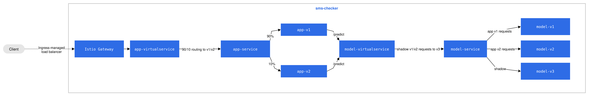
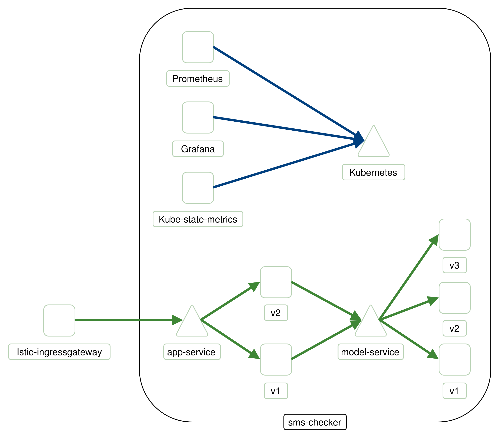
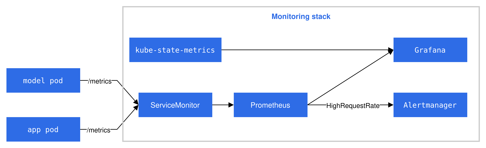

# Deployment Documentation

This file documents the deployment process of our application.

## Components

Our application is composed of a frontend (`app-service`) and a backend (`model-service`). To support continuous experimentation, we deploy two parallel versions of each service (`v1` and `v2`). The Istio service Mesh is deployed to manage traffic flow, enforce routing policies for versions and as a gateway for user requests.

Moreover, we also deploy monitoring measures such as Prometheus and Grafana. More on that in the Monitoring section.

## Cluster Resources & Scaling

The deployment is configured with specific replica counts to support our stability and testing requirements (90/10 split).

### Services & Replicas

| Component | Version | Role | Replicas | Service Name |
| :--- | :--- | :--- |:---------| :--- | 
| **App** | v1 | Stable | **3**    | `app-service` |
| **App** | v2 | Canary | **1**    | `app-service` |
| **Model** | v1 | Stable | **3**    | `model-service` |
| **Model** | v2 | Canary | **1**    | `model-service` |
| **Model** | v3 | Shadow | **1**    | `model-service` |

## Data Flow

The request follows the following path:

1. **Istio Gateway**: Once a user sends a request to the cluster, it goes through the Istio Gateway, which acts as a single entry point for external traffic.
2. **App (Frontend) Service**: The request is forwarded to the Virtual Service of the app, which routes the request to one of the deployed versions of the app service.
3. **Model (Backend) Service**: When a prediction request is sent from the frontend, it flows to the backend service and is intercepted by the Virtual Service, which decides which version of the model service to route the request to, based on the sourceLabels set by the app service. Moreover, we have implemented Shadow Launch, which mirrors all requests to `v3` of the model service for testing purposes without affecting the user experience.

Our application supports consistent versioning; thus, if a user request is handled by `v1` of the app service, the internal logic guarantees, through sourceLabels, that it will be handled by `v1` of the model service and not `v2`.

Figure 1: Diagram in Kubernetes-style detailing request path
## Routing Decision Process

Two files are responsible for the decision process of the routing:

* **Virtual Service of the app**: Here, we define the ratio of the requests sent to versions 1 and 2. We currently route 90% of the traffic to the stable version (`v1`) and 10 % to the canary release (`v2`) used for testing.
* **Destination Rule**: This file defines the subset of pods based on Kubernetes labels. Subset `v1` is routed to version 1 pods, and accordingly for version 2.

The resulting request flow can be seen in Kiali from which the diagram below was made. We see requests to app-service split into request for `v1` and `v2` and for model-service into v1`, `v2` and `v3`. The request flow for the metric collection is also visible in the diagram, where Prometheus, Grafana and kube-state-metrics poll Kubernetes for metrics. 

Figure 2: Diagram from Kiali showing the request flow in practice 

## Continuous Experimentation

10% of users are routed to the canary group to test new features. We use Sticky Session to ensure consistent versioning for the entirety of the session.

## Monitoring
For observability purposes, we utilize Prometheus metrics and Grafana to visualize the patterns of the app usage.

Prometheus scrapes metrics from the app service and exports them through \metrics endpoint. We currently export 5 metrics in total, of 3 different types (histogram, counter, gauge), mostly focusing on the requests and responses sent to/from model-service.

We also utilize Alert Manager to trigger an alert if number of request exceed 15 requests per minute.

We visualize the metrics in Grafana which allows us to compare the performance of different versions, supporting continuous experimentation.

Figure 3: Diagram detailing the request flow for monitoring

## Setup Details

The following configuration is required to access the deployment:

* **Hosts**: `sms-checker.local`
* **Ports**: Port 80
* **Paths**: The application is served at:
    * `/` Hello World - Starting page
    * `/sms` Page allowing to enter sms messages
    * `/metrics` Page responsible for exporting metrics in Prometheus format

## Configuration
We use Kubernetes resources to configure the deployment:
* **ConfigMap**: It is used to specify app port as well as model_host URL.
* **Secrets**: Store sensitive information such as SMTP credentials.
